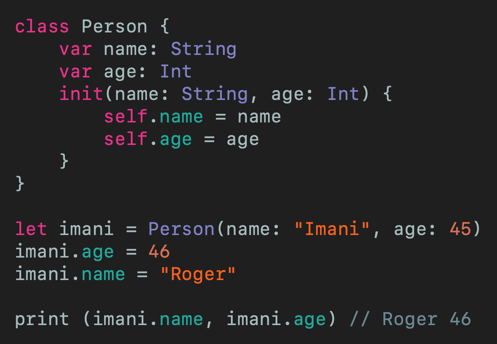
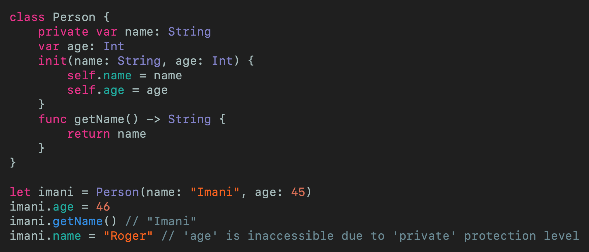
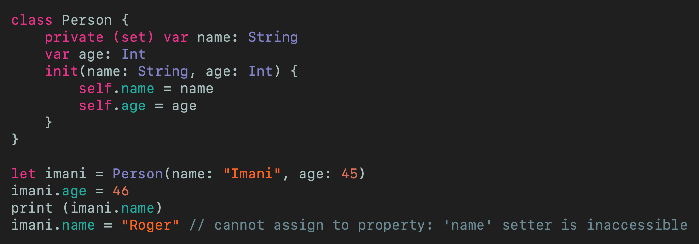

# Public Getters and Private Setters in Swift
## Accessible rather the settable. GO!

 
Photo by Markus Spiske on Unsplash

You have a public `class` or `struct`, and want the client of the object to be able to access a property but not set it. What to do...

Difficulty: Beginner | Easy | **Normal** | Challenging 
This article has been developed using Xcode 11.5, and Swift 5.2.4

## Prerequisites: 
* This article is written in a [Playground](https://medium.com/@stevenpcurtis.sc/coding-in-swift-playgrounds-1a5563efa089) but I'm assuming you are comfortable with [classes and structures (Class and Struct](https://medium.com/swift-coding/when-to-use-class-or-struct-in-swift-e6037147c1d)

# The example 
Imagine you have a `Person` class. You don't need a great imagination, because here is a possible `Class` right here HERE:

Thie thinking behind this is that someone's age is likely to change (I don't know about you, but my age changes every year, usually increasing). This means that I'm comfortable with the name being changed, but the age, not so much. 

WE SHOULDN'T BE ALLOWED TO CHANGE THE NAME DIRECTLY. 

## Solution number 1
Use the private modifier for the age, but that means we can't access the age at all!
How can we get over this impass?
We can access the property through a function.
 
[Click for Gist](https://gist.github.com/stevencurtis/b381c0cc08bb6d45dc5eac311cd35301) 

Which is...ok...but this invovles us creating a new function just to access the property.

## Solution number 2
Here we go. 

 
[Click for Gist](https://gist.github.com/stevencurtis/bfc1c5eb5a8de03b1c98d6e4067a5324) 

This makes our `class` much closer to the initial `class`. 

# Conclusion
You might like to 

If you've any questions, comments or suggestions please hit me up on [Twitter](https://twitter.com/stevenpcurtis) 
